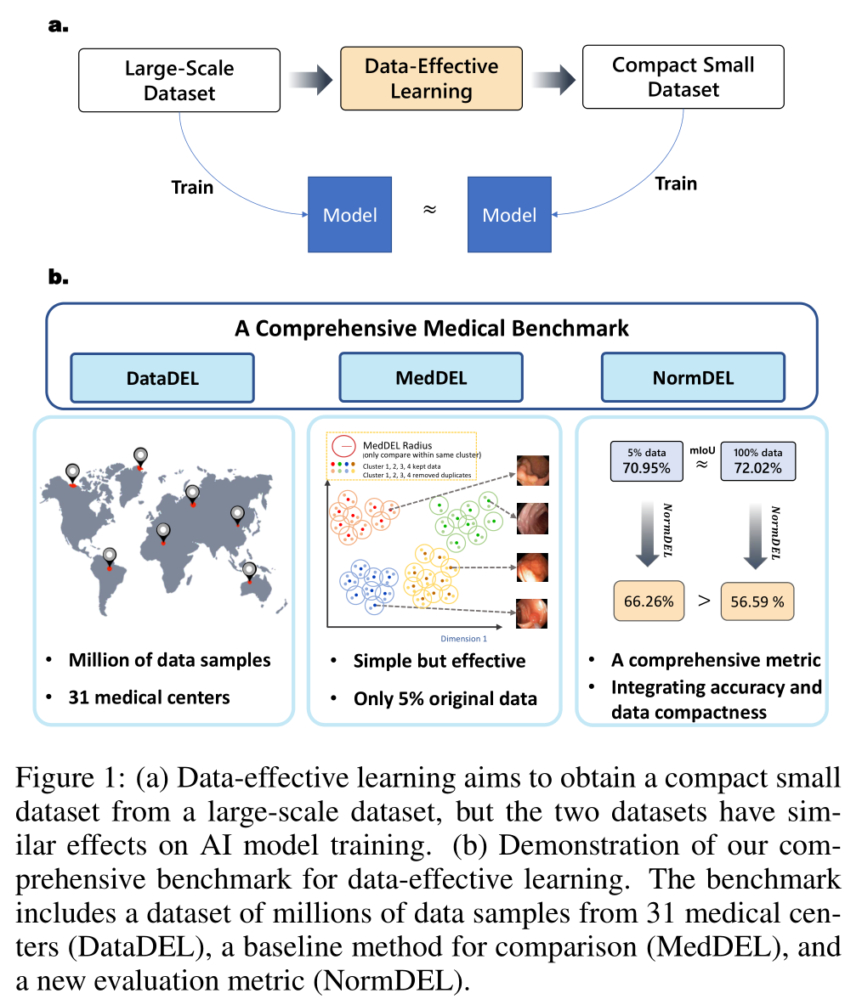
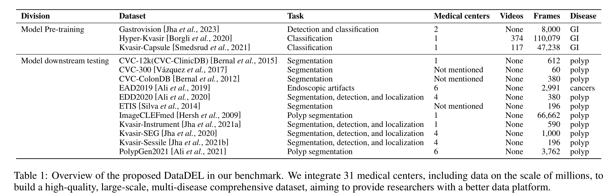
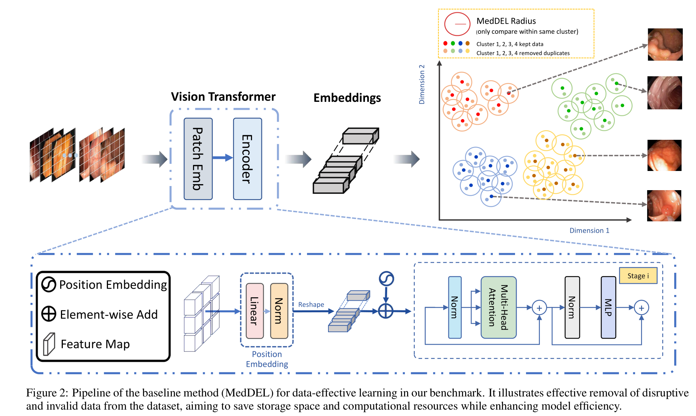

# Data-Effective Learning: A Comprehensive Medical Benchmark
We introduce the concept of Data-Effective Learning, which plays a significant role in the field of medical data, accelerating model training and reducing storage burden in the era of big data (Fig 1(a)).

Data-effective learning aims to obtain a compact small dataset from a large-scale dataset, but the two datasets have similar effects on AI model training.

This repo is the official implementation of ["Data-Effective Learning: A Comprehensive Medical Benchmark"](https://arxiv.org/abs/2401.17542). 

It consists of three parts, a dataset with millions of data samples (DataDEL), a baseline method for comparison (MedDEL), and a new evaluation metric (NormDEL) ((Fig 1(b))). 

<div style="text-align: center;">
  
</div>

## Updates

**_1/30/2024_**

Initial commits:

1. The introduction of our Comprehensive Medical Benchmark.

## Abstact

**Data-effective learning** aims to use data in the most impactful way to train AI models, which involves strategies that focus on data quality rather than quantity, ensuring the data used for training has high informational value. Data-effective learning plays a profound role in accelerating AI training, reducing computational costs, and saving data storage, which is very important as the volume of medical data in recent years has grown beyond many people's expectations. However, due to the lack of standards and comprehensive benchmark, research on medical data-effective learning is poorly studied. To address this gap, our paper introduces a comprehensive benchmark specifically for evaluating data-effective learning in the medical field. This benchmark includes a dataset with millions of data samples from 31 medical centers (DataDEL), a baseline method for comparison (MedDEL), and a new evaluation metric (NormDEL) to objectively measure data-effective learning performance. Our extensive experimental results show the baseline MedDEL can achieve performance comparable to the original large dataset with only 5% of the data. Establishing such an open data-effective learning benchmark is crucial for the medical AI research community because it facilitates efficient data use, promotes collaborative breakthroughs, and fosters the development of cost-effective, scalable, and impactful healthcare solutions.


## Introduction
In the era of big data, large models often require massive pre-training data. However, our perspective challenges this conventional thinking, and we have undertaken the following work to explore this issue in depth.

There are three parts in our benchmark, a dataset with millions of data samples (DataDEL), a baseline method for comparison (MedDEL) and a new evaluation metric (NormDEL). 

### DataDEL
Our efforts focus on integrating datasets from over 31 different centers and 23 different countries, spanning multiple modalities such as images and videos. Furthermore, our dataset surpasses the million-scale mark, becoming a large-scale collection that encompasses multiple tasks, modalities, sources, and diseases. This dataset can provide rich and diverse support for subsequent research, offering significant convenience for healthcare professionals and research institutions.


### MedDEL
We introduce a benchmark baseline method (MedDEL) in the endoscopic medical field, which is based on the principles of the SemDeDup method.


### NormDEL
We propose a new data-effective metric, the Normalized Delete Index (NormDEL). Our objective is that within the same task, if a model can achieve the same level of performance in downstream tasks using fewer pre-training data, its data-effective performance should be considered superior.

$$
DEL=mIoU \cdot e^{-\alpha \cdot R}
$$

$$
NormDEL=\frac{1}{1+e^{-DEL}}
$$

## Citing Us

```
@inproceedings{
yang2024a,
title={A Medical Data-Effective Learning Benchmark for Highly Efficient Pre-training of Foundation Models},
author={Wenxuan Yang and Weimin Tan and Yuqi Sun and Bo Yan},
booktitle={ACM Multimedia 2024},
year={2024},
url={https://openreview.net/forum?id=n10Ax1bixC}
}
```
